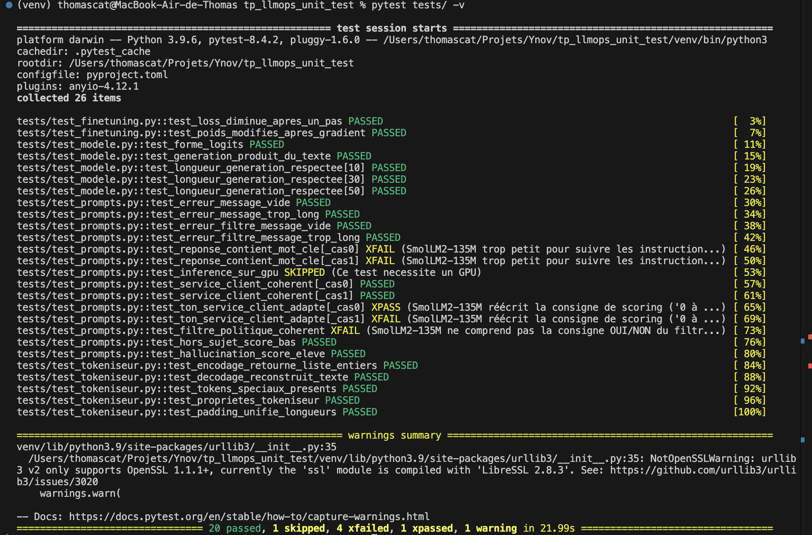
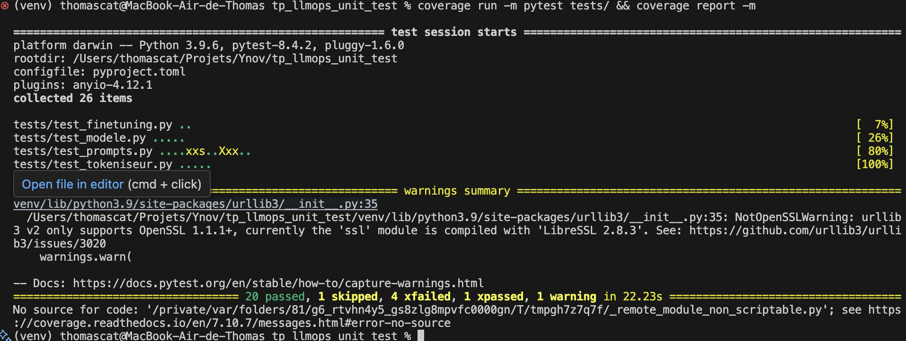
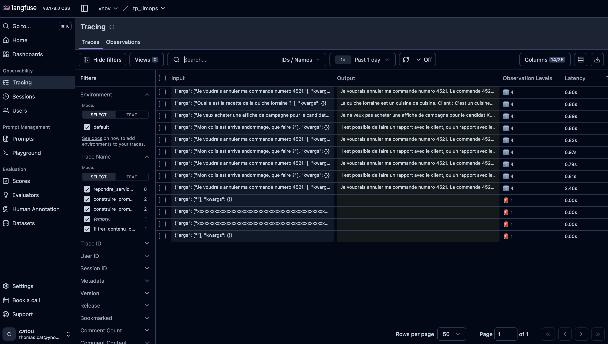
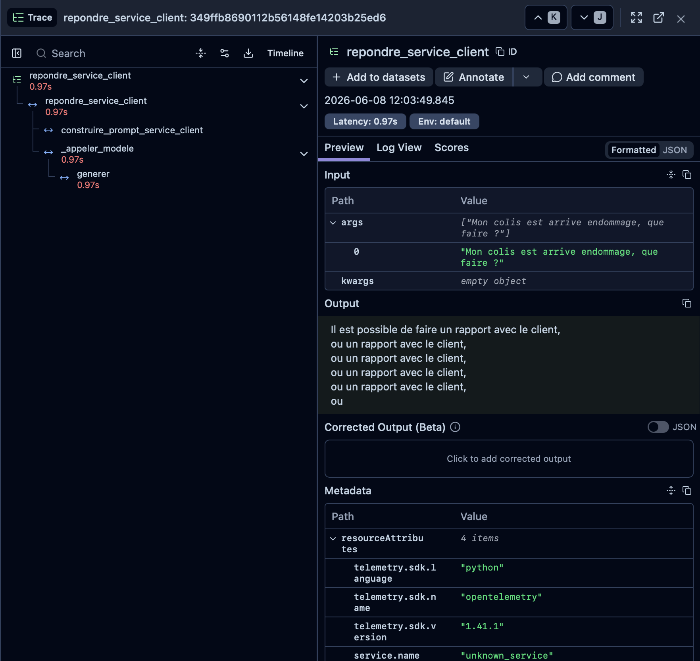
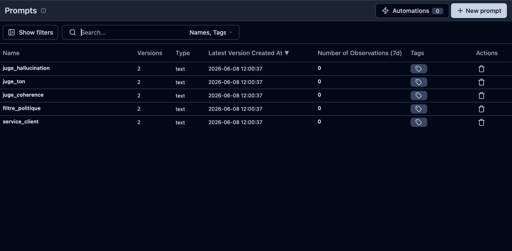

# LLMOps — Tests unitaires pour les LLM avec pytest
 
Mise en place d'une infrastructure de **tests automatisés et d'observabilité** pour un pipeline LLM de service client, en suivant les pratiques LLMOps.


---

## Contexte

Les applications LLM échouent silencieusement : un pipeline peut retourner du texte grammaticalement correct mais incohérent, biaisé ou halluciné — sans lever la moindre exception Python. Ce projet implémente une suite de tests complète pour détecter ces comportements, ainsi qu'une stack d'observabilité pour les tracer en production.

> *"Un modèle non testé est un modèle dont on ne sait pas s'il fonctionne."*

---

## Stack technique

| Outil | Rôle |
|---|---|
| `Python 3.9` | Langage principal |
| `HuggingFace Transformers` | Modèle LLM (SmolLM2-135M) |
| `PyTorch` | Inférence et fine-tuning |
| `pytest` | Framework de tests |
| `coverage` | Mesure de couverture de code |
| `Langfuse` | Observabilité, tracing et prompt management |
| `Docker Compose` | Stack Langfuse auto-hébergée |

---

## Architecture du projet

```
tp_llmops/
├── src/
│   ├── langfuse_prompts.py   # Client Langfuse + gestion des prompts
│   ├── tokeniseur.py         # Wrapper AutoTokenizer
│   ├── modele.py             # Wrapper AutoModelForCausalLM + @observe
│   └── prompts.py            # Fonctions métier avec gardes + @observe
├── tests/
│   ├── dataset.py            # Dataset de test structuré
│   ├── test_tokeniseur.py    # Tests unitaires tokeniseur
│   ├── test_modele.py        # Tests fonctionnels modèle
│   ├── test_finetuning.py    # Tests de fine-tuning
│   └── test_prompts.py       # Tests erreurs + sémantiques (LLM juge)
├── scripts/
│   └── seed_langfuse.py      # Initialisation des prompts dans Langfuse
└── docker-compose.yml        # Stack Langfuse locale
```

---

## Taxonomie des tests implémentés

### Tests unitaires — vérifier une brique isolée

```python
def test_erreur_message_vide():
    with pytest.raises(ValueError, match="non vide"):
        construire_prompt_service_client("")
```

### Tests fonctionnels — vérifier un use case complet

```python
@pytest.mark.parametrize("_nb_tokens_max", [10, 30, 50])
def test_longueur_generation_respectee(_nb_tokens_max):
    # traverse tout le pipeline : tokeniseur → modèle → décodage
    assert _nb_tokens_max <= max_tokens
```

### Tests de fine-tuning — vérifier que l'entraînement fonctionne

```python
def test_loss_diminue_apres_un_pas():
    # propriété minimale : la loss doit diminuer après un pas de gradient
    assert _loss_apres < _loss_avant
```

### Tests sémantiques — LLM comme juge

```python
def test_service_client_coherent(_cas):
    _reponse = repondre_service_client(_cas["_entree"])
    _score = _appeler_juge("juge_coherence", _prompt_juge)
    assert _score > 0.5  # évalue le sens, pas juste la forme
```

---

## Résultats des tests



**26 tests collectés — 20 passed, 1 skipped, 4 xfailed, 1 xpassed**

| Statut | Signification |
|---|---|
| `PASSED` | Test réussi |
| `XFAIL` | Échec attendu et documenté (SmolLM2-135M trop petit) |
| `XPASS` | Marqué xfail mais passe quand même |
| `SKIPPED` | `test_inference_sur_gpu` — pas de GPU disponible |

> Les `XFAIL` illustrent une pratique LLMOps clé : **documenter les limites du modèle** plutôt que de les masquer. Ces tests passeraient avec un modèle instruct de taille suffisante (Mistral-7B, GPT-4...).

---

## Couverture de code



| Fichier | Couverture |
|---|---|
| `src/modele.py` | 100% |
| `src/prompts.py` | 100% |
| `src/tokeniseur.py` | 100% |
| `src/langfuse_prompts.py` | 64% (branches Langfuse — clés API requises) |
| **Total** | **88%** |

---

## Observabilité avec Langfuse

Chaque fonction du pipeline est instrumentée avec le décorateur `@observe()` de Langfuse, qui trace automatiquement les entrées, sorties, durées et erreurs.

### Liste des traces



### Détail d'une trace — hiérarchie des appels



La hiérarchie tracée automatiquement :
```
repondre_service_client (0.97s)
  └── construire_prompt_service_client
  └── _appeler_modele
        └── generer
```

### Gestion des prompts versionnés



Les 5 prompts sont versionnés dans Langfuse avec le label `production` :

| Prompt | Rôle |
|---|---|
| `service_client` | Répond aux messages clients en français |
| `filtre_politique` | Détecte les contenus politiques (OUI/NON) |
| `juge_coherence` | Évalue la cohérence d'une réponse (0→1) |
| `juge_ton` | Évalue l'adéquation du ton (0→1) |
| `juge_hallucination` | Détecte les hallucinations (0→1) |

---

## Lancer le projet

### Prérequis
```bash
python -m venv venv && source venv/bin/activate
pip install -r requirements.txt -r requirements_dev.txt
```

### Lancer les tests
```bash
pytest tests/ -v
```

### Couverture
```bash
coverage run -m pytest tests/ && coverage report -m
```

### Stack Langfuse locale (Docker)
```bash
docker compose up -d
# Interface disponible sur http://localhost:3000
```

### Initialiser les prompts dans Langfuse
```bash
# Copier .env.example → .env et renseigner les clés API
python scripts/seed_langfuse.py
```

---

## Concepts clés abordés

- **Tokenisation BPE** — conversion texte → tokens → IDs entiers
- **Tests paramétrés** — `@pytest.mark.parametrize` pour multiplier les cas
- **Skip conditionnel** — `@pytest.mark.skipif` pour ignorer sans GPU
- **xfail** — documenter les échecs attendus plutôt que les masquer
- **LLM juge** — utiliser un LLM pour évaluer sémantiquement les sorties d'un autre LLM
- **Couverture de code** — mesurer les lignes effectivement exécutées pendant les tests
- **Prompt management** — versionner et déployer les prompts comme du code
- **Tracing** — tracer la hiérarchie des appels et les latences en production
